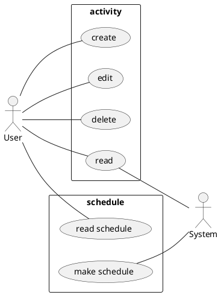
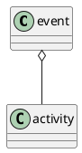
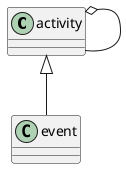
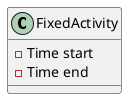
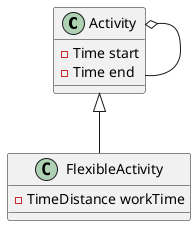

# GOAL
## Main goal
The main goal of our system is automatically scheduled your all activity.
### Use Diagramm

# Definition
## Activity
#### Event and activity
In the course of SoftwareTechnik by Dr.Prof. Bruege, we learned that
> a event is combination of activity.

***But i like another description on dictionary***
> a event is a thing that happens or takes place, especially one of importance.

### What is a activity in our system
In our system a activity can be any thing,what you are going to do.
e.g.:
  + course
  + work
  + meeting

it can also be:
  + sleep
  + eat

### Fixed or Flexiable
In traditional time or project management applications the activity can only be fixed.But  in reality the time of activity can also be subjectively determined. E.g. do homework or read some thing.

UML is like so:
* Traditional

* Our

### Importance
