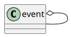
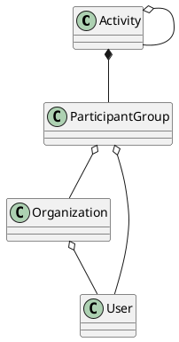

# TEAM
## Name Of TEAM
+ SchduleAI(temporary)
## Team Member
+ Bernardo Garibay
+ Yushen Zhang
+ Boning Li
+ Ye Liu
+ Xiaolin Ma

## Briefly Introduce Our Thoughts
An intelligent system that automatically schedules all your events

# PROBLEM AND HOW TO SOLVE
## Main Problem
As technology advances, the problems we have to deal with are getting more and more complicated.We need to plan our schedule so that we don’t mess things up.But existing applications don't solve problems well.
### Current Situation
The mainstream personal events management application is now divided into two forms.
#### Calendar
##### Example:
Google Calendar, Apple Calendar ,Outlook Calendar
##### Advantage
The calendar can better deal with events that are really fixed, such as courses or doctor appointments.
##### Disadvantage
Calendar can't cope with change. All events in the calendar are fixed.Once there is interference, you can’t continue to follow the plan. The plan that will not be disturbed basically does not exist. The user of the calendar will give up completely after several failures.

#### TodoList
Unlike calendars, todolist is a bit rougher. You only need to record what you need to do, and not clearly plan when you want to do them.
##### Advantage
You don't need to deal with changes, everything is subjective regulation.
##### Disadvantage
Most people will mistakenly estimate their efficiency and put most of the things back to the end to complete. Not even finished.

### Our Solution
Our solution is to make a new intelligent system. Combine calendars with todolist.The user enters the event into the system in the form of a todolist. The system then uses the algorithm to re-plan the event after each change occurs. It’s also possible to alert users when they’re short of time.

## Subsidiary Problem
### Covey's Time Management Grid
The Covey time management grid is an effective method of organizing your priorities. As you can see from the grid below, there are four quadrants organized by urgency and importance.

Users in our system don't pay attention to the urgency of the event, but still need to manually input the importance.

#### Aolution
The importance of our system is divided into five levels.

### Terrible Big Problem
The Seven Wonders of the World Looks Unfinished. Face huge problems are terrible.This is easy for people to give up.
#### Solution
The solution is to disassemble them into small pieces and complete them step by step. In our system we use the structure of the tree to allow users to split events.

### Document Dispersion
We use different software to pass information(or doc.).
We often have an intersection with different events in the same time period with the same person. Our important data is often mixed together.
#### Solution
So we need to change our behavior patterns. We should not talk to someone because of something. It should be talking about things. In our system, an event can be thought of as a folder. Put all the information in it. If we have any discussion, we should discuss it under this event. So that we can easily trace back all the ideas and problems of things.

### Lazy Human
Our intention is to improve people's efficiency, not to create more jobs.But we can't perceive the needs of users. So user input is essential.Users are likely to abandon us because of extra input work.
#### Solution
So we want to make the user's input as simple as possible.We mainly through two ways.

##### Template Aystem.
A task tree, or one of its children, can be saved as a template for reuse.

##### Import
We can import schedules and data from other systems.
For example: google calendar, moodle.

##### Machine Learning
We can use machine learning in the future to automatically populate attributes based on work content.Like importance or tags.

### Wrong Prediction
Not everyone has a clear understanding of themselves, such as writing homework, and some people think that it takes only half of the time to take 20 minutes. Others may need 3 times longer.
#### Aolution
At the beginning we always plan more time. When we have enough data, we can use machine learning or strong algorithms to accurately predict the time required by users.

### Noisy Or Missed Message
Even if the communication program may be annoying when we work, if you completely shut them down, you may miss important notifications.
#### Solution
We filter event messages based on how important the event is being executed.

### Adaptability
Different events often have different functional requirements.
#### Solution
We implemented an interface for the event. Allow users to import the required components. For example, a form or a video resource.

### Version Control
Large software development is inseparable from version control. Version control is also a good tool for non-programmers. But not many non-programmers who know and use version control. An old joke about the paper is. The final version, the final second edition. The final third edition. Absolutely not revised version....
#### Solution
We did a simple version control for the event's file manager. The user only needs to modify the contents of the file and submit it. The system automatically manages different versions of the document.

## More Features
to be continued...

### Organization
Unlike slack, only channel and direct message. An organization should also be recursive. A company consists of branches, a branch can have many departments, and a department can have many groups.Each team has its own home and office space and configurable extensions.

A Organization can act as a legal person to accept, publish, or complete a task.

The difference between an OrganizationGruppe and a ParticipantGroup in an activity is that the organization is almost static, and the ParticipantGroup in the activity exists only due to activity.

### More uses of templates
We can publish templates in different ways to achieve different purposes to meet different needs.
For example:

We can publish templates in a shared way to plan and invites a banquet.
We can publish a template in the form of a copy to do a survey.
We can publish templates  in the form of copies with general topics to make a online course.

And more..

#FEEDBACK
They are too many problems we want to solve. But that is not possible to solve that all in one semester and in 10 mins pitch. So this semester, we will only focus on our kern function, schedule and display all activities (events + todos) in the calendar. And we will try to make a product, not just a demo at last.
